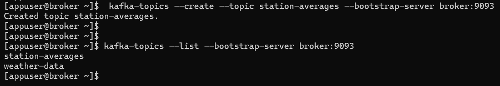

# Real-Time processing with Kafka-streams


## Purpose

in this activity we try to use `kafka-streams API` to performs an example of real-time processing.
the example is about caught `weather data` stored in `weather-data topic` and then compute the `temperature mean` and 
`mean of humidity` by `station name` and store results in another topic called `station-averages`.

the weather data are stored in a `string format` like: `station,temperature(in cel),humidity(%)`


## Kafka cluster

in order to achieve the purpose mentioned above, 
first we need to get a `kafka cluster` where our topics stored and managed, 
so we choose to deploy our kafka cluster using `docker`.

### docker-compose file

```yaml

services:
  zookeeper:
    image: confluentinc/cp-zookeeper:7.7.1
    container_name: zookeeper
    hostname: zookeeper
    environment:
      ZOOKEEPER_CLIENT_PORT: 2181
      ZOOKEEPER_TICK_TIME: 2000
    ports:
      - 22181:2181

    networks:
      - kafka-net
  
  broker:
    image: confluentinc/cp-kafka:7.7.1
    container_name: broker
    hostname: broker
    depends_on:
      - zookeeper
    ports:
      - 9092:29092
    environment:
      KAFKA_BROKER_ID: 0
      KAFKA_ZOOKEEPER_CONNECT: zookeeper:2181
      KAFKA_LISTENERS: INTERNAL://:9093,EXTERNAL_SAME_HOST://:29092
      KAFKA_ADVERTISED_LISTENERS: INTERNAL://broker:9093,EXTERNAL_SAME_HOST://localhost:9092
      KAFKA_LISTENER_SECURITY_PROTOCOL_MAP: INTERNAL:PLAINTEXT,EXTERNAL_SAME_HOST:PLAINTEXT
      KAFKA_INTER_BROKER_LISTENER_NAME: INTERNAL
      KAFKA_OFFSETS_TOPIC_REPLICATION_FACTOR: 1
    
    networks:
      - kafka-net


networks:
  kafka-net:
    driver: bridge
```


### Start kafka cluster

to start our cluster containing services described in 
`docker-compose.yml` file above, first we nagivate where docker-compose file is located then we use the following command:

```shell
docker-compose up -d
```


so we got our cluster ready:


### Create weather-data topic

to create `weather-data` topic, first we need to open a new terminal and access broker bash:

```shell
docker exec -it <broker-ID> bash
```


then we can create `weather-data` topic:

```shell
kafka-topics --create --topic weather-data --bootstrap-server broker:9093
```


this terminal will be used for `kafka-console-producer` later.


### Create station-averages topic

the same process will be applied to create `station-averages` topic, 
first we need to access `broker` shell:

```shell
docker exec -it <broker-ID> bash
```


and then:

```shell
kafka-topics --create --topic station-averages --bootstrap-server broker:9093
```



this terminal will be used for `kafka-console-consumer` later.


## Weather analyser application

in this section, we try to create a `Java application` that use `kafka-streams` to perform real-time processing,
by reading weather data from `weather-data` topic and calculate the humidity and temperature means for each station.

we organized our application in some packages:
- `models`: where we define and modeling our manipulated classes, such as `Weather` and `WeatherStationState` records.
- `utils`: here we define some util methods.
- `serdes`: in order to store and retrieve data from kafka topic we need a mechanism that ensure data integrity during serialization
    and deserialization of our object of type `Weather` and `WeatherStationState`, so we need to create custom serializers and deserializers
    for those types.

and finally we have our main class `WeatherAnalyser` where we create and configure our process pipeline.

### application dependencies

```xml
<dependencies>
    <dependency>
        <groupId>org.apache.kafka</groupId>
        <artifactId>kafka-streams</artifactId>
        <version>3.8.0</version>
    </dependency>

    <dependency>
        <groupId>org.slf4j</groupId>
        <artifactId>slf4j-api</artifactId>
        <version>2.0.16</version>
    </dependency>
    <dependency>
        <groupId>org.slf4j</groupId>
        <artifactId>slf4j-simple</artifactId>
        <version>2.0.16</version>
    </dependency>

    <!-- https://mvnrepository.com/artifact/com.fasterxml.jackson.core/jackson-databind -->
    <dependency>
        <groupId>com.fasterxml.jackson.core</groupId>
        <artifactId>jackson-databind</artifactId>
        <version>2.18.1</version>
    </dependency>

    <dependency>
        <groupId>org.projectlombok</groupId>
        <artifactId>lombok</artifactId>
        <version>1.18.34</version>
    </dependency>

</dependencies>
```


### models package

to avoid `string spliting` every time we need to access to weather attribute value like `station` or `temperature`,
we notice that our weather data is recorded as a `String` in format : `staton,temperature,humidity`.

that is why we create a `record` called `Weather` to model weather data:

```java
package md.hajji.models;

public record Weather(
        String station,
        double temperature,
        double humidity
) {

    @Override
    public String toString() {
        return String.format("%s,%.2f,%.2f", station, temperature, humidity);
    }
}
```

in kafka streams there is no aggregation method or function that allow us to compute means, so that is why
create `WeatherStationState` which used to model aggregation station where we can save 
station data like sum of temperature, sum of humidities and also how many records appropriate to 
given station, and then later we can easily compute the means them:


```java
package md.hajji.models;

public record WeatherStationState(
        long count,
        double temperatures,
        double humidities
) {

    /**
     * initialize a new state
     * @return : {@code WeatherStationState} instance
     */
    public static WeatherStationState initialize(){
        return new WeatherStationState(0L, 0.0, 0.0);
    }

    /**
     * emit new {@code WeatherStationStata} computed from {@code Weather} instance
     * @param weather: {@code Weather} instance
     * @return  new {@code WeatherStationStata}
     */
    public WeatherStationState update(Weather weather){
        return new WeatherStationState(
                count + 1,
                temperatures + weather.temperature(),
                humidities + weather.humidity()
        );
    }
    
    /**
     * summarize a {@code WeatherStationState} instance by computing mean of temperature and
     * humidity mean
     * @param station : appropriate station name
     * @return state summary as {@code String}
     */
    public String summarize(String station){
        return String.format(
                "station: %s, MT: %.2f Fah, MH: %.2f %%",
                station,
                temperatures / count,
                humidities / count
        );
    }
    
}
```

### Serdes package

for our models `Weather` and `WeatherStationState` we need to define their appropriate serializers and deserializers
a serializer is just a class that implement `Serializer<T>` interface and the same thing for creating a deserializer,
implement `Deserializer<T>` interface, 
those serializers and deserializers will be user by a `Serde` classes, a Serde stand for serializer / deserializer couple
for same type let say `Weather`, a serde class is a class that implement `Serde<T>` interface.


#### SerdesUtils

in this class we try to define `read` and `write` methods based on `ObjectMapper` instance provided by `jackson`, to ensure 
byte serialization / deserialization.

```java
package md.hajji.serdes;

import com.fasterxml.jackson.core.JsonProcessingException;
import com.fasterxml.jackson.databind.ObjectMapper;
import lombok.SneakyThrows;

import java.io.IOException;

public class SerdesUtils {

    /**
     * {@code ObjectMapper} instance used for serialization and deserialization
     */
    private static final ObjectMapper OBJECT_MAPPER = new ObjectMapper();

    /**
     * write an object as bytes
     * util for byte serialization
     * @param source : serialized object
     * @return {@code byte[]}
     */
    @SneakyThrows({JsonProcessingException.class})
    public static byte[] write(Object source){
        return OBJECT_MAPPER.writeValueAsBytes(source);
    }

    /**
     * deserialize an object of type T
     * @param source: byte array that represent the encoded object
     * @param clazz: the class of the result object
     * @return an object of type {@code T}
     * @param <T> : type parameter that represent the class destination
     */
    @SneakyThrows({IOException.class})
    public static <T> T read(byte[] source, Class<T> clazz){
        return OBJECT_MAPPER.readValue(source, clazz);
    }

}

```

#### WeatherSerde

```java
package md.hajji.serdes;

import md.hajji.models.Weather;
import org.apache.kafka.common.serialization.Deserializer;
import org.apache.kafka.common.serialization.Serde;
import org.apache.kafka.common.serialization.Serializer;


public class WeatherSerde implements Serde<Weather> {

    // weatherSerializer and WeatherDeserializer instances:
    private final WeatherSerializer weatherSerializer = new WeatherSerializer();
    private final WeatherDeserializer weatherDeserializer = new WeatherDeserializer();

    /**
     * get Weather serializer
     * @return {@code WeatherSerializer} instance
     */
    @Override
    public Serializer<Weather> serializer() {
        return weatherSerializer;
    }

    /**
     * get Weather deserializer
     * @return {@code WeatherDeserializer} instance
     */
    @Override
    public Deserializer<Weather> deserializer() {
        return weatherDeserializer;
    }
}

/**
 * {@code WeatherSerializer} used for {@code Weather} Serialization
 */
class WeatherSerializer implements Serializer<Weather> {

    @Override
    public byte[] serialize(String s, Weather weather) {
        return SerdesUtils.write(weather);
    }
}

/**
 * {@code WeatherDeserializer} used for {@code Weather} Deserialization
 */
class WeatherDeserializer implements Deserializer<Weather> {

    @Override
    public Weather deserialize(String s, byte[] bytes) {
        return SerdesUtils.read(bytes, Weather.class);
    }
}
```


#### WeatherStationStateSerde

```java
package md.hajji.serdes;

import md.hajji.models.WeatherStationState;
import org.apache.kafka.common.serialization.Deserializer;
import org.apache.kafka.common.serialization.Serde;
import org.apache.kafka.common.serialization.Serializer;


public class WeatherStationStateSerde implements Serde<WeatherStationState> {

    // weather station state serializer
    private final WeatherStationStateSerializer
            weatherStationStateSerializer = new WeatherStationStateSerializer();
    // weather station state deserializer
    private final WeatherStationStateDeserializer weatherStationStateDeserializer =
            new WeatherStationStateDeserializer();

    /**
     * serialize {@code WeatherStationState} instance
     * @return {@code Serializer<WeatherStationState>} object
     */

    @Override
    public Serializer<WeatherStationState> serializer() {
        return weatherStationStateSerializer;
    }

    /**
     * deserialize {@code WeatherStationState} instance
     * @return Deserializer<WeatherStationState> object
     */
    @Override
    public Deserializer<WeatherStationState> deserializer() {
        return weatherStationStateDeserializer;
    }

}

/**
 * WeatherStationStateSerializer
 */
class WeatherStationStateSerializer implements Serializer<WeatherStationState> {
    @Override
    public byte[] serialize(String s, WeatherStationState state) {
        return SerdesUtils.write(state);
    }
}

/**
 * WeatherStationStateDeserializer
 */
class WeatherStationStateDeserializer implements Deserializer<WeatherStationState> {

    @Override
    public WeatherStationState deserialize(String s, byte[] bytes) {
        return SerdesUtils.read(bytes, WeatherStationState.class);
    }
}
```


#### WeatherSerdes

this class will be used to get our serdes for both `Weather` and `WeatherStationState`:


```java
package md.hajji.serdes;

public class WeatherSerdes{

    /**
     * {@code WeatherSerde} instance
     */
    public static final WeatherSerde WEATHER_SERDE = new WeatherSerde();
    /**
     * {@code WeatherStationStateSerde} instance
     */
    public static final WeatherStationStateSerde WEATHER_STATION_STATE_SERDE =
            new WeatherStationStateSerde();

    /**
     * get {@code WeatherSerde} instance
     * @return {@code WeatherSerde} instance
     */
    public static WeatherSerde weatherSerde(){
        return WEATHER_SERDE;
    }

    /**
     * get {@code WeatherStationStateSerde} instance
     * @return {@code WeatherStationStateSerde} object
     */
    public static WeatherStationStateSerde weatherStateSerde(){
        return WEATHER_STATION_STATE_SERDE;
    }

}
```


### Utils package

in this package we define some utility functions grouped in `WeatherFunctions` class, functions or methods
like `static Weather from(String weatherString){...} `, and others:

```java
package md.hajji.utils;


import md.hajji.models.Weather;
import md.hajji.models.WeatherStationState;
import org.apache.kafka.streams.KeyValue;

public class WeatherFunctions {

    /**
     * cast a weather string like "station,temperature,humidity" to a Weather instance
     * @param weatherString: weather string like "station,temperature,humidity"
     * @return : Weather instance
     */
    public static Weather from(String weatherString){
        String[] tokens = weatherString.split(",");
        return new Weather(
                tokens[0],
                Double.parseDouble(tokens[1]),
                Double.parseDouble(tokens[2])
        );
    }

    /**
     * map a Weather instance into another by changing temperature unit from cellulitis to Fahrenheit
     * @param weather : weather object
     * @return : new {@code Weather} object with temperature expressed in Fahrenheit unit.
     */
    public static Weather mapToFahrenheit(Weather weather){
        double fahrenheit = (weather.temperature() * 9/5) + 32;
        return new Weather(weather.station(), fahrenheit, weather.humidity());
    }

    /**
     * return a boolean value based on Weather instance temperature
     * used to filter weather instances if the temperature is under 30 Cel
     * @param weather: weather object
     * @return : {@code true} if temperature is over 30 Cel, else {@code false}
     */
    public static boolean filterWeatherByTemperature(Weather weather){
        return weather.temperature() > 30.0;
    }

    /**
     * log in the console key and value of a kafka record for a special debugging stage
     * @param key: record key
     * @param value: record value
     * @param stage: Debugging stage
     */
    public static void log(String key, Object value, DebuggingStage stage){
        System.out.println("[" + stage + "]: {key: " + key + ", value: " + value + "}");
    }

    /**
     * summarize a final state with s simple string contains important infos
     * @param station: station name
     * @param state: {@code WeatherStationState} instance that describe the final state of given station
     * @return : {@code KeyValue} pair with station as a key and weatherState summary.
     */
    public static KeyValue<String, String> summarizeState(String station, WeatherStationState state){
        return new KeyValue<>(station, state.summarize(station));
    }

    /**
     * weather state aggregator for aggregation function
     * @param station : record key
     * @param weather: record value as {@code Weather} instance
     * @param state: the current {@code WeatherStationState} object that describe current state of aggregator.
     * @return : the new {@code WeatherStationState} object that describe new state of aggregator.
     */
    public static WeatherStationState weatherStateAggregator(
            String station,
            Weather weather,
            WeatherStationState state){
        return state.update(weather);
    }

}
```

in order to get a clean and significant log messages in the console, 
we add `DebuggingStage` enum for logging purposes, to associate log messages to a specific stage:

```java
package md.hajji.utils;

/**
 * distinct the debugging state
 */
public enum DebuggingStage {

    READ, // for the first time we read from weather-data topic
    CONVERT, // after weather string has converted to weather instance
    FILTER, // after remove records witch a temp < 30 cel
    MAP_TO_FAHRENHEIT, // after mapping temperature of a record from cel to Fah
    AGGREGATE, // after applying aggregation function
    SUMMARIZE // after convert final state to a string
}

```


### WeartherAnalyser class

our main class where we create our `streams` and turn on our processing pipeline:


```java
package md.hajji;

import md.hajji.models.WeatherStationState;
import md.hajji.serdes.WeatherSerdes;
import md.hajji.utils.DebuggingStage;
import md.hajji.utils.WeatherFunctions;
import org.apache.kafka.common.serialization.Serdes;
import org.apache.kafka.streams.KafkaStreams;
import org.apache.kafka.streams.StreamsBuilder;
import org.apache.kafka.streams.StreamsConfig;
import org.apache.kafka.streams.kstream.Consumed;
import org.apache.kafka.streams.kstream.Grouped;
import org.apache.kafka.streams.kstream.Materialized;
import org.apache.kafka.streams.kstream.Produced;
import java.util.Properties;

public class WeatherAnalyser {

    //kafka streams properties values:
    static final String APPLICATION_ID = "weather-analyser-application";
    static final String BOOTSTRAP_SERVERS = "localhost:9092";
    static final String INPUT_TOPIC = "weather-data";
    static final String OUTPUT_TOPIC = "station-averages";

    public static void main(String[] args) {

        // define kafka streams properties:
        Properties kafkaProps = new Properties();
        kafkaProps.put(StreamsConfig.APPLICATION_ID_CONFIG, APPLICATION_ID);
        kafkaProps.put(StreamsConfig.BOOTSTRAP_SERVERS_CONFIG, BOOTSTRAP_SERVERS);
        kafkaProps.put(StreamsConfig.DEFAULT_KEY_SERDE_CLASS_CONFIG, Serdes.String().getClass());
        kafkaProps.put(StreamsConfig.DEFAULT_VALUE_SERDE_CLASS_CONFIG, Serdes.String().getClass());

        // get StreamsBuilder instance:
        StreamsBuilder builder = new StreamsBuilder();

        // start consumer weather string like "station,temperature,humidity"
        //  with String seres for both key and value:
        builder.stream(INPUT_TOPIC, Consumed.with(Serdes.String(), Serdes.String()))
                // log results of read stage:
                .peek((key, value) -> WeatherFunctions.log(key, value, DebuggingStage.READ))
                // convert every weather string record to Weather instance
                .mapValues(WeatherFunctions::from)
                // log results for Convert stage:
                .peek((key, value) -> WeatherFunctions.log(key, value, DebuggingStage.CONVERT))
                // drop down weather instances with temperature under 30 cel:
                .filter((_, weather) -> WeatherFunctions.filterWeatherByTemperature(weather))
                // log results for Filter stage
                .peek((key, value) -> WeatherFunctions.log(key, value, DebuggingStage.FILTER))
                // convert weather temperature to Fahrenheit unit:
                .mapValues(WeatherFunctions::mapToFahrenheit)
                // log results for Transform stage:
                .peek((key, value) -> WeatherFunctions.log(key, value, DebuggingStage.MAP_TO_FAHRENHEIT))
                // group weather record by station name
                // specifying also serde for both station name as key and weather record as value
                .groupBy((_, weather) -> weather.station(), Grouped.with(Serdes.String(), WeatherSerdes.weatherSerde()))
                // perform aggregation function for calculating sum of humidities and temperatures
                // by station name
                .aggregate(
                        // get new state for every station:
                        WeatherStationState::initialize,
                        // inject aggregator function:
                        WeatherFunctions::weatherStateAggregator,
                        // use String and weatherStateSerde as serde for station name and weatherStationState
                        Materialized.with(Serdes.String(), WeatherSerdes.weatherStateSerde())
                )
                // convert KTable to KStream:
                .toStream()
                // log results of aggregation stage:
                .peek((key, value) -> WeatherFunctions.log(key, value, DebuggingStage.AGGREGATE))
                // convert each final state to string summary:
                .map(WeatherFunctions::summarizeState)
                // log results for summarize stage:
                .peek((key, value) -> WeatherFunctions.log(key, value, DebuggingStage.SUMMARIZE))
                // write results to output topic: station-averages:
                .to(OUTPUT_TOPIC, Produced.with(Serdes.String(), Serdes.String()));
        
        // define kakfka streams object with appropriate builder and properties:
        KafkaStreams streams = new KafkaStreams(builder.build(), kafkaProps);
        //start kafkaStreams process:
        streams.start();
        // add nice way to shuting down kafka streams process:
        Runtime.getRuntime().addShutdownHook(new Thread(streams::close));

    }
}
```


## Execution

before starting our java application, let's activate our `kafka-console-consumer` on `station-averages` topic,
so in the `consumer terminal`:

```shell
kafka-console-consumer --topic station-averages --bootstrap-server broker:9093
```


then we can start our `WeatherAnalyser` application and try to produce some weather data `weather-data` topic,
so first we need to activate `kafka-console-producer`, so in `producer terminal`: 

```shell
kafka-console-producer --topic weather-data --bootstrap-server broker:9093
```

then we start produce some data:


in our application logs, we got:


in station-averages topic we got:


